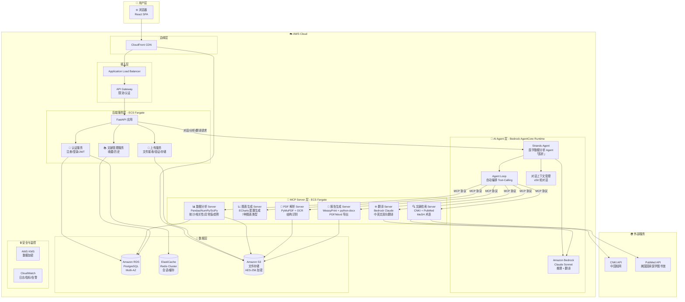
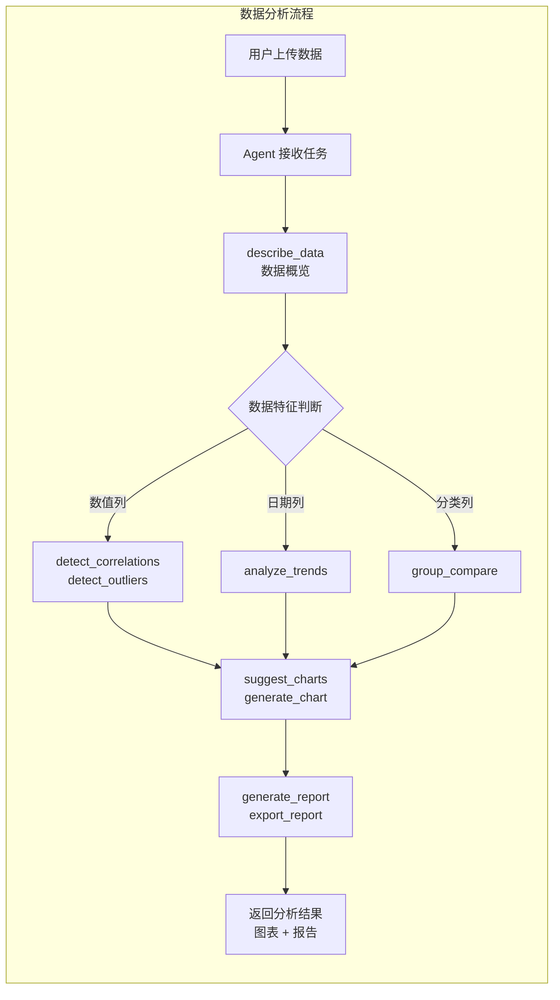
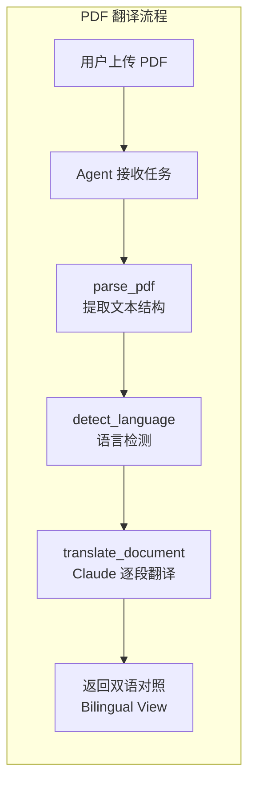
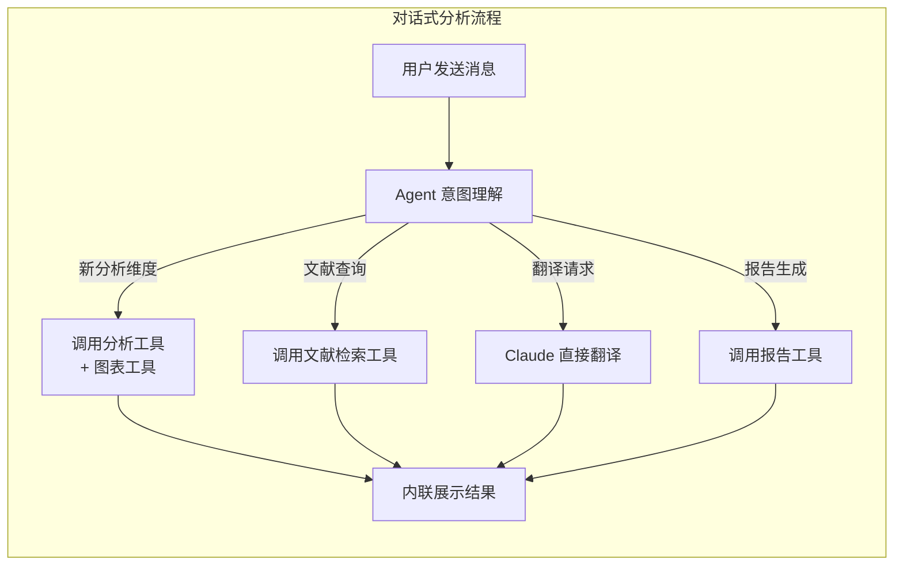
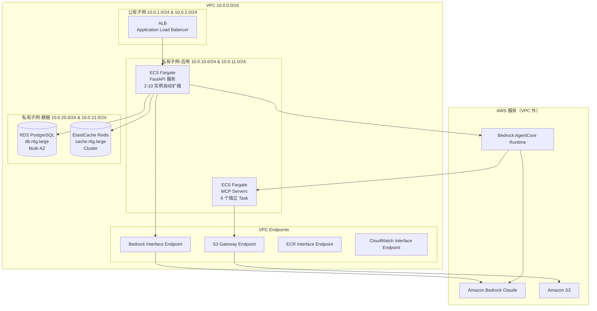
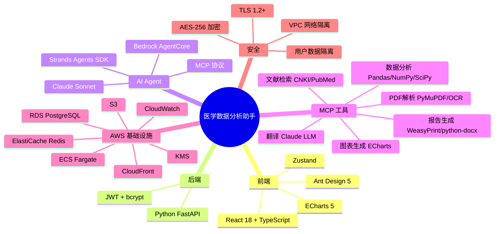

# 医学数据分析助手 - 系统架构图

## 整体系统架构

```mermaid
graph TB
    subgraph "👤 用户层"
        Browser[🌐 浏览器<br/>React SPA]
    end

    subgraph "☁️ AWS Cloud"
        subgraph "边缘层"
            CF[CloudFront CDN]
        end

        subgraph "接入层"
            ALB[Application Load Balancer]
            APIGW[API Gateway<br/>限流/认证]
        end

        subgraph "后端服务层 - ECS Fargate"
            FastAPI[FastAPI 应用]
            UploadSvc[📁 上传服务<br/>文件接收/验证/存储]
            AuthSvc[🔐 认证服务<br/>注册/登录/JWT]
            LitSvc[📚 文献管理服务<br/>收藏/历史]
        end

        subgraph "🤖 AI Agent 层 - Bedrock AgentCore Runtime"
            StrandsAgent[Strands Agent<br/>医学数据分析 Agent<br/>「医析」]
            AgentLoop[Agent Loop<br/>自动编排 Tool-Calling]
            ConvMgr[对话上下文管理<br/>≤50 轮对话]
            LLM[Amazon Bedrock<br/>Claude Sonnet<br/>推理 + 翻译]
        end

        subgraph "🔧 MCP Server 层 - ECS Fargate"
            MCP1[📊 数据分析 Server<br/>Pandas/NumPy/SciPy<br/>统计/相关性/异常值/趋势]
            MCP2[📈 图表生成 Server<br/>ECharts 配置生成<br/>7种图表类型]
            MCP3[🔍 文献检索 Server<br/>CNKI + PubMed<br/>MeSH 术语]
            MCP4[🌐 翻译 Server<br/>Bedrock Claude<br/>中英文双向翻译]
            MCP5[📄 PDF 解析 Server<br/>PyMuPDF + OCR<br/>结构识别]
            MCP6[📝 报告生成 Server<br/>WeasyPrint + python-docx<br/>PDF/Word 导出]
        end

        subgraph "💾 数据层"
            RDS[(Amazon RDS<br/>PostgreSQL<br/>Multi-AZ)]
            Redis[(ElastiCache<br/>Redis Cluster<br/>会话/缓存)]
            S3[(Amazon S3<br/>文件存储<br/>AES-256 加密)]
        end

        subgraph "🔒 安全与监控"
            KMS[AWS KMS<br/>数据加密]
            CW[CloudWatch<br/>日志/指标/告警]
        end
    end

    subgraph "🌍 外部服务"
        CNKI[CNKI API<br/>中国知网]
        PubMed[PubMed API<br/>美国国家医学图书馆]
    end

    %% 连接关系
    Browser --> CF
    CF --> S3
    CF --> ALB
    ALB --> APIGW --> FastAPI

    FastAPI --> UploadSvc
    FastAPI --> AuthSvc
    FastAPI --> LitSvc
    FastAPI -->|对话/分析/翻译请求| StrandsAgent

    StrandsAgent --> AgentLoop
    StrandsAgent --> ConvMgr
    StrandsAgent --> LLM

    AgentLoop -->|MCP 协议| MCP1
    AgentLoop -->|MCP 协议| MCP2
    AgentLoop -->|MCP 协议| MCP3
    AgentLoop -->|MCP 协议| MCP4
    AgentLoop -->|MCP 协议| MCP5
    AgentLoop -->|MCP 协议| MCP6

    MCP3 --> CNKI
    MCP3 --> PubMed
    MCP4 --> LLM

    UploadSvc --> S3
    MCP1 --> S3
    MCP5 --> S3
    MCP6 --> S3

    AuthSvc --> RDS
    AuthSvc --> Redis
    MCP1 --> RDS
    LitSvc --> RDS
```

## Agent 自动编排流程

```mermaid
flowchart LR
    subgraph "数据分析流程"
        A1[用户上传数据] --> A2[Agent 接收任务]
        A2 --> A3[describe_data<br/>数据概览]
        A3 --> A4{数据特征判断}
        A4 -->|数值列| A5[detect_correlations<br/>detect_outliers]
        A4 -->|日期列| A6[analyze_trends]
        A4 -->|分类列| A7[group_compare]
        A5 --> A8[suggest_charts<br/>generate_chart]
        A6 --> A8
        A7 --> A8
        A8 --> A9[generate_report<br/>export_report]
        A9 --> A10[返回分析结果<br/>图表 + 报告]
    end
```

```mermaid
flowchart LR
    subgraph "PDF 翻译流程"
        B1[用户上传 PDF] --> B2[Agent 接收任务]
        B2 --> B3[parse_pdf<br/>提取文本结构]
        B3 --> B4[detect_language<br/>语言检测]
        B4 --> B5[translate_document<br/>Claude 逐段翻译]
        B5 --> B6[返回双语对照<br/>Bilingual View]
    end
```

```mermaid
flowchart LR
    subgraph "对话式分析流程"
        C1[用户发送消息] --> C2[Agent 意图理解]
        C2 -->|新分析维度| C3[调用分析工具<br/>+ 图表工具]
        C2 -->|文献查询| C4[调用文献检索工具]
        C2 -->|翻译请求| C5[Claude 直接翻译]
        C2 -->|报告生成| C6[调用报告工具]
        C3 --> C7[内联展示结果]
        C4 --> C7
        C5 --> C7
        C6 --> C7
    end
```

## 网络架构

```mermaid
graph TB
    subgraph "VPC 10.0.0.0/16"
        subgraph "公有子网 10.0.1.0/24 & 10.0.2.0/24"
            ALB2[ALB<br/>Application Load Balancer]
        end

        subgraph "私有子网-应用 10.0.10.0/24 & 10.0.11.0/24"
            ECS1[ECS Fargate<br/>FastAPI 服务<br/>2-10 实例自动扩缩]
            ECS2[ECS Fargate<br/>MCP Servers<br/>6 个独立 Task]
        end

        subgraph "私有子网-数据 10.0.20.0/24 & 10.0.21.0/24"
            DB[(RDS PostgreSQL<br/>db.r6g.large<br/>Multi-AZ)]
            Cache[(ElastiCache Redis<br/>cache.r6g.large<br/>Cluster)]
        end

        subgraph "VPC Endpoints"
            EP1[S3 Gateway Endpoint]
            EP2[Bedrock Interface Endpoint]
            EP3[ECR Interface Endpoint]
            EP4[CloudWatch Interface Endpoint]
        end
    end

    subgraph "AWS 服务（VPC 外）"
        AC[Bedrock AgentCore Runtime]
        BR[Amazon Bedrock Claude]
        S3E[Amazon S3]
    end

    ALB2 --> ECS1
    ECS1 --> AC
    AC --> ECS2
    AC --> BR
    ECS1 --> DB
    ECS1 --> Cache
    ECS2 --> EP1 --> S3E
    ECS1 --> EP2 --> BR
```

## 技术栈总览

```mermaid
mindmap
    root((医学数据分析助手))
        前端
            React 18 + TypeScript
            Ant Design 5
            ECharts 5
            Zustand
        后端
            Python FastAPI
            JWT + bcrypt
        AI Agent
            Strands Agents SDK
            Bedrock AgentCore
            Claude Sonnet
            MCP 协议
        MCP 工具
            数据分析 Pandas/NumPy/SciPy
            图表生成 ECharts
            文献检索 CNKI/PubMed
            翻译 Claude LLM
            PDF解析 PyMuPDF/OCR
            报告生成 WeasyPrint/python-docx
        AWS 基础设施
            ECS Fargate
            RDS PostgreSQL
            ElastiCache Redis
            S3
            CloudFront
            KMS
            CloudWatch
        安全
            AES-256 加密
            TLS 1.2+
            用户数据隔离
            VPC 网络隔离
```
